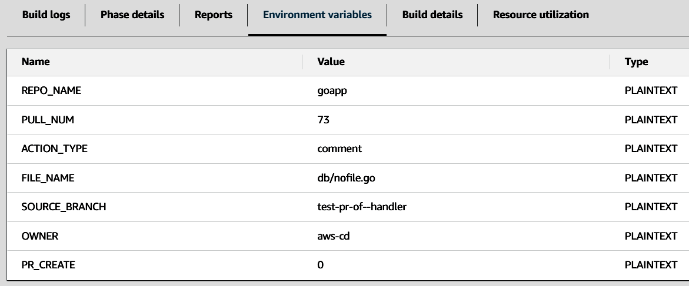

<h1 align="center"> AI Handler for Applications repositories </h1>

## Description
For application repositories, we have implemented a solution that works with pull request comments requests. Depending on the comments we have several actions for AI:

1) unit tests generation
2) code explanation
3) code coverage by comments

## Workflow:

PR Comment in a specific format → GitHub webhook triggered by ISSUE_COMMENT event → Lambda as a front door of the request → CodeBuild as a main handler and communicator with AI → output in PR comments (by default) or as a new PR

## Diagram


## Terraform module
There is Terraform module [ai_handler](../../modules/accelerator/ai_handler) for this solution.

You can deploy it by setting variable `ai_handler_create = true` in [env.hcl](../../terragrunt-infrastructure-example/accelerator/accounts/accelerator/regions/example/setup_folder/applications/example/env.hcl) file, when you do initial setup for application CI/CD and deploy [setup_folder](../../terragrunt-infrastructure-example/accelerator/accounts/accelerator/regions/example/setup_folder)


## Webhook
Webhook URL is a URL of Lambda function. Webhook and its settings are created automatically once the terraform code deployed


We react on **ISSUE_COMMENT** event only


# **Infrastructure**
## Lambda

Lambda is the main point to receive a payload of GitHub webhook. Parse it, detect a keyword we check to start AI handler, and check action type (unit test, code explanation, comment coverage). Detect repository parameters: PR number, owner of the repository, repository name, and whether we create a new PR with results or not. It has several main options

### Layer

It contains a request Python module because it doesn't support Lambda by default. An additional layer is a workaround on how to install it


The Terraform module has a zip file with this Layer we deploy along with the Terraform code.

The Layer contains the Request Python module zip file which is not available in Lambda by default.


### Environment variables

CodeBuild name and GitHub Token



### Python code

It resides in the terraform code and is deployed by terraform


### Runtime

As Python 3.11


### Enabled Function URL

We use it as a front door to trigger the Lambda function by a webhook from GitHub


## CodeBuild

If the condition of a comment in a PR is met our conditions, it triggers a CodeBuild, which executes AI handler script [ai_cicd_analyzer.py](../../docs/template_config_files/scripts/ai/ai_cicd_analyzer.py).

- [**buildspec_with_ai.yml**](../../docs/template_config_files/buildspec_with_ai.yml) should be copied to the application repository.


## Python code

As a step of codebuild we must run our AI script
```
build:
  commands:
    - python ${CODEBUILD_SRC_DIR}/scripts/ai/ai_cicd_analyzer.py
```

Source code also exists in the Infra repository for reference but in the target application repository it should be placed manually in the folder scripts/ai together with requirements.txt in the scripts folder


## Environment variables

They passed by Lambda directly


## Source of CodeBuild

An important step to force it to work properly. Settings deployed by Terraform code.


## Results
Call for a Help Menu


## Unit test generation


## Code explanation


## Code coverage by comments


## Wrong file path or name


## With pull request option (for comments and unit tests only)


## If the branch generated by AI already exists


