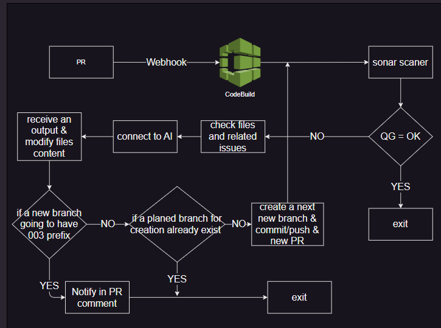
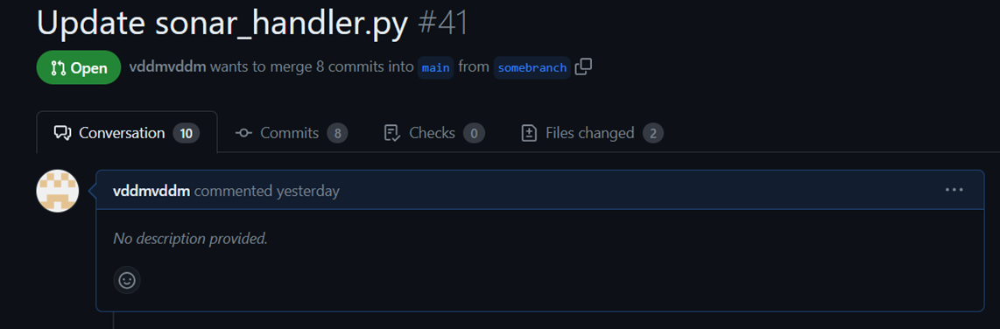
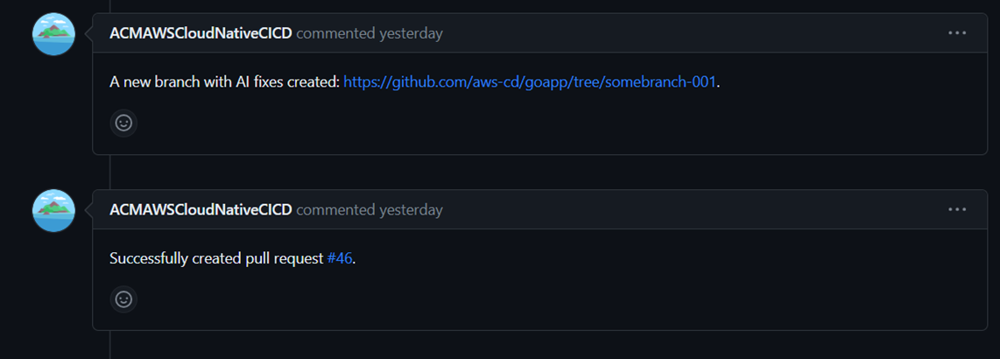
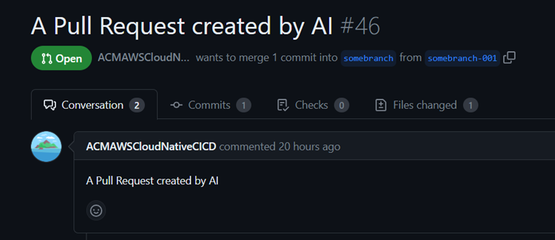
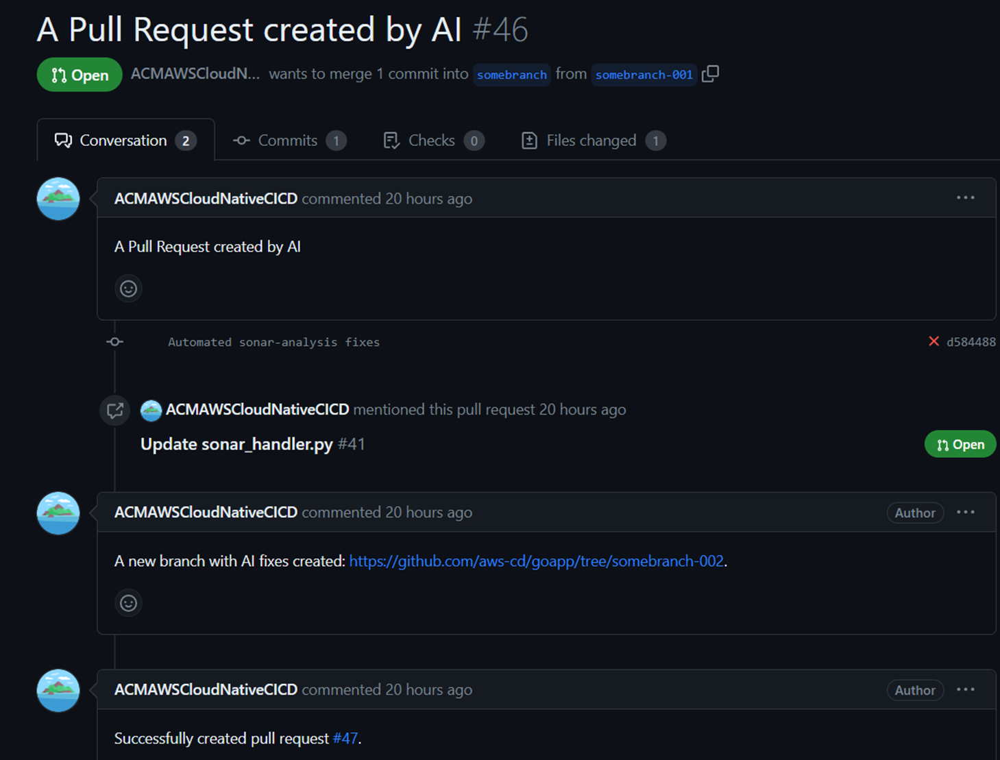
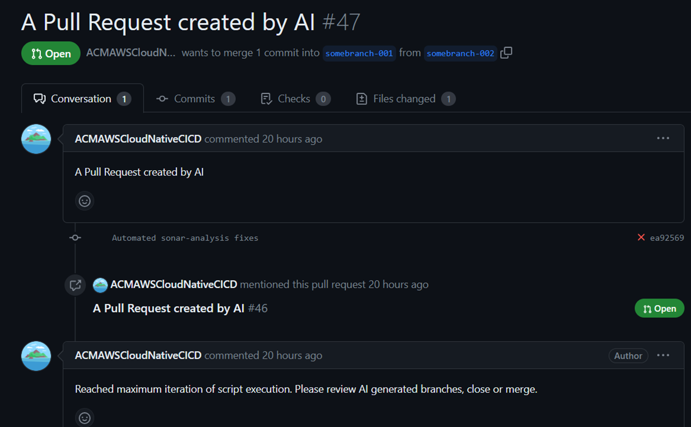
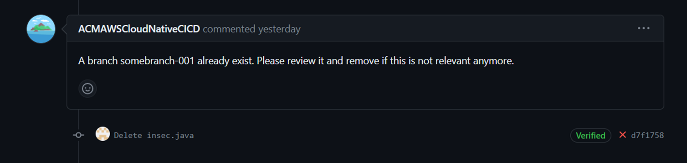
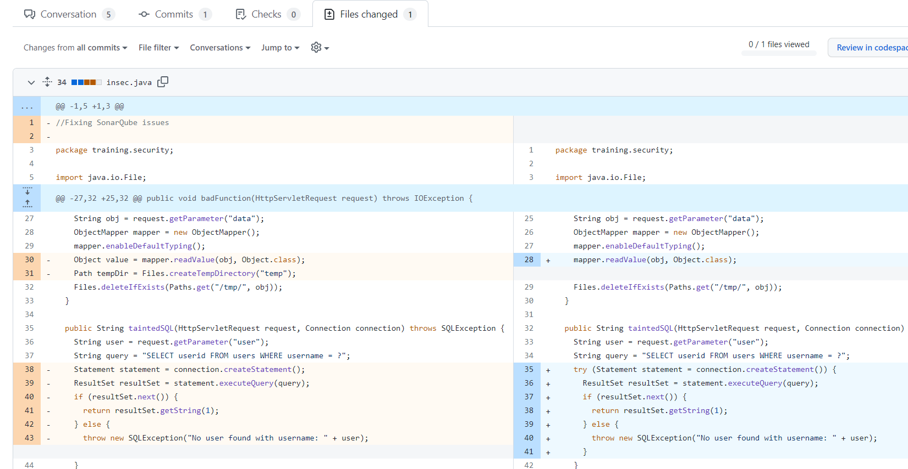

<h1 align="center"> QualityGate issues handler for App repositories </h1>

## Goal
Auto fix of SonarQube Quality Gate issues for application repositories

## Workflow:
1) Once a new PR is created, we trigger a CodeBuild by a webhook

2) Sonar scanner preinstalled in CodeBuild. If the quality gate fails during the scan we execute AI script

3) The script grabs all the files and all the related issues. Send to AI. Receive some output.

4) Create a new branch with a prefix (001 for example)

5) Create a new PR from the new branch

6) Run the same process again

7) If Quality Gate fails check with AI again.

8) Create a new branch with the prefix 002

9) Create a new PR from the branch

10) If Quality Gate fails again we send a comment in PR that we reached a maximum number of iteration

## Diagram

## Terraform code
We do not have some specific terraform code for this solution since this is a part of our previous solution for the sonar scanner based on pull request events.

## Source code
- Buildspec for CodeBuild

This [buildspec_pr.yml](../AI/quality_gate_error_handler/buildspec_pr.yml) must be placed in the root folder of the repository with the application. Codebuild we use for Sonar Scaner configured already to use this file name.

- AI script [sonar_handler.py](../../docs/template_config_files/scripts/ai/sonar_handler.py) and requirements we store in [ai](../../docs/template_config_files/scripts/ai) folder in `scripts` directory.
- We run AI script if internal CodeBuild variable CODEBUILD_BUILD_SUCCEEDING  = 0 (if the build step fails. It is possible only if the quality gate failed) and at the same time we provide AI token (currently is OpenAI)

## Results
- An initial pull request created

- An issue happened and we ran a script to create a new branch with -001 prefix and a pull request from it

- A new pull request

- If the Quality Gate still fails after AI modifications in the problematic files we run the process again

- A branch with the prefix -002 will be the last iteration in case AI can not fix the issue completely and some issue still exist

- Also, if we try to run AI script from the branch that already has AI-generated branch we will receive a warning in the PR comments

- Results of files modifications in a PR

