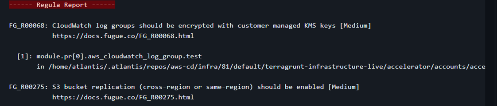
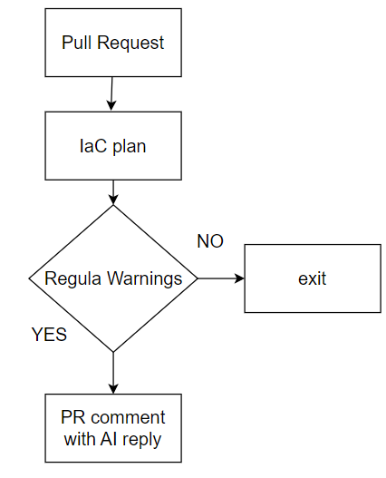
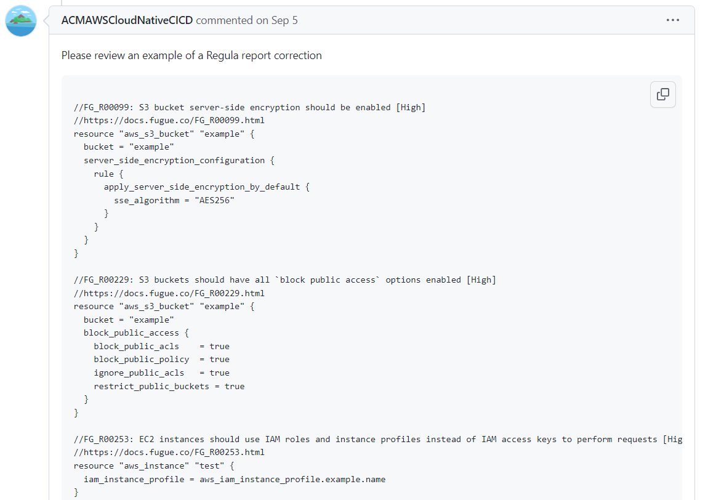

<h1 align="center"> Regula error handler </h1>


Currently, we use 3 main security tools to analyze terraform code on security vulnerabilities.

- Regula

- TFSec

- TFLint

The solution explained below handles the error log file left after Regula execution. Handle the error and left the advice in a Pull Request comment.

Regula is a part of Atlantis workflow to deploy terraform code.


TFSec and TFLint provide their own advice after each execution since it is their built-in feature.

Regula also but the advice usually doesn`t have a proper example or doesn`t have it at all. That`s why we came to the conclusion AI in this scope can be helpful.


## Regula report example



## Atlantis integration
AI handler for Regula report is a part of Atlantis. All details of how we run it can be found in atlantis.yaml

We force Atlantis to store Regula output in the error log file

```
- run: if [ $REGULA == 1 ];
    then
    echo "------ Regula Report ------" && regula run -t tf-plan $SHOWFILE > regula_report.log && regula_report.log || cat regula_report.log && echo "-------------------------------------";
    fi
- run: if [ -n "$OPENAI_API_KEY" ] && [ -s "regula_report.log" ] && ! grep -q "No problems found" regula_report.log;
    then
    python3 /home/atlantis/.atlantis/repos/${BASE_REPO_OWNER}/${BASE_REPO_NAME}/${PULL_NUM}/${WORKSPACE}/regula_analyzer.py;
    fi
```

1) We run Regula and forward everything to the log file regula_report.log

2) If Regula has some warnings or concerns we print it out to the terminal.

3) If $OPENAI_API_KEY environment variable is set (we take it from the SSM and also manage this in atlantis.yaml) and regula_report.log is not empty and the log file doesn`t contain a special string "No problems found" → we run the script regula_analyzer.py

The path /home/atlantis/.atlantis/repos/${BASE_REPO_OWNER}/${BASE_REPO_NAME}/${PULL_NUM}/${WORKSPACE}/ it is a usual path for each pull request created and managed by Atlantis.

## Diagram


## Script
[Regula_script](../../scripts/regula_analyzer.py)

## Results
Appear in the PR comment



