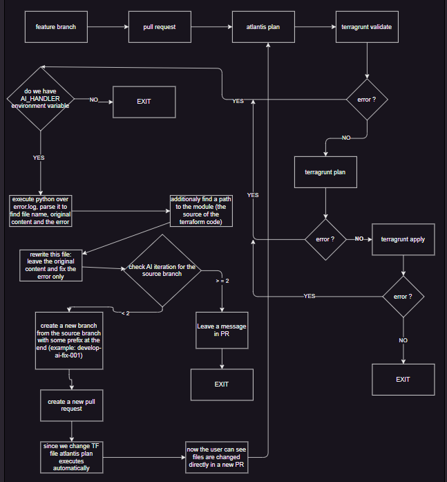
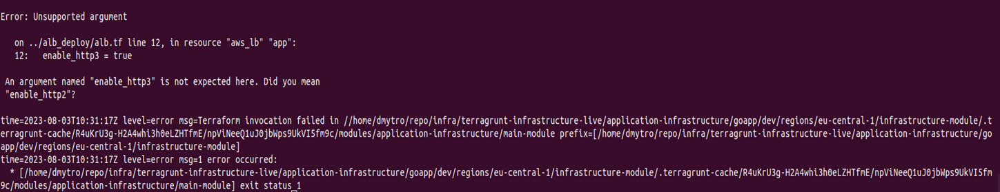
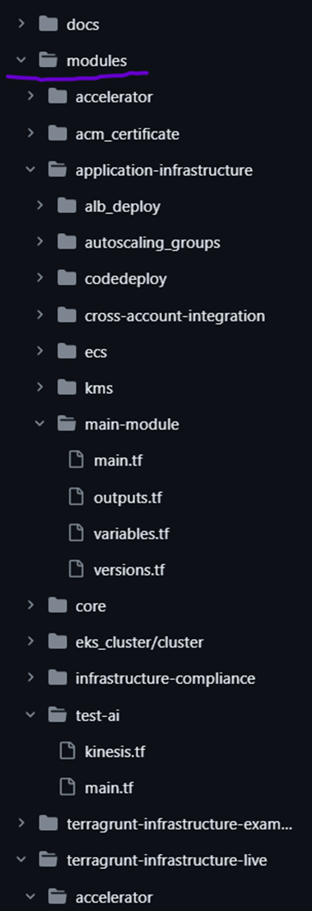
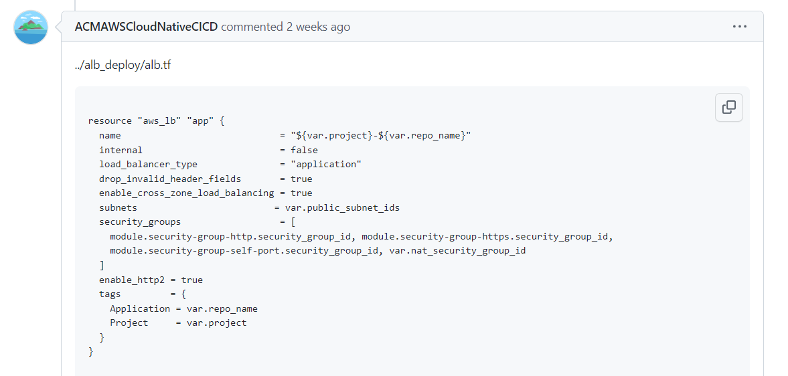
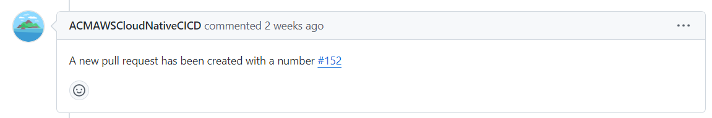
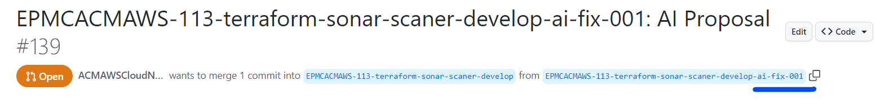
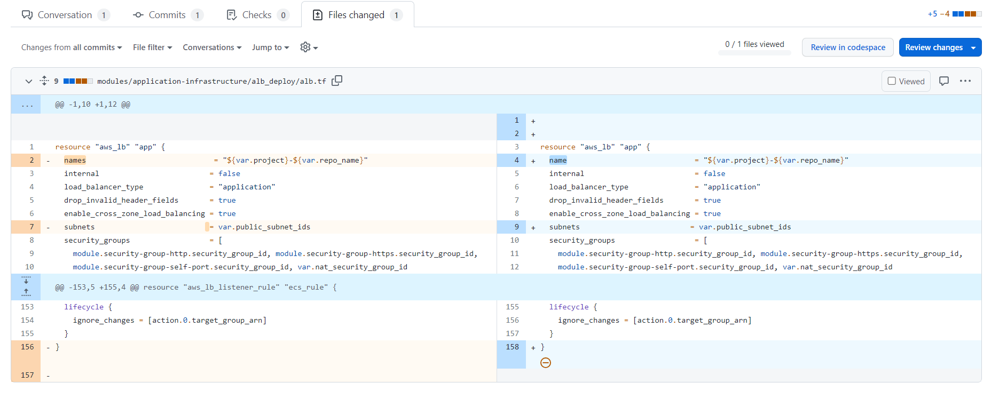
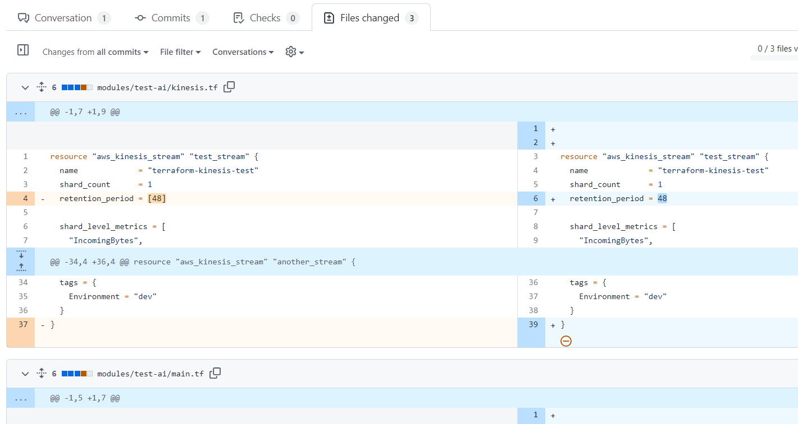
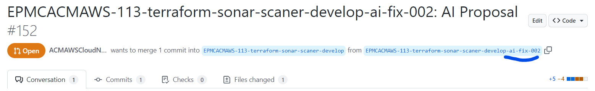
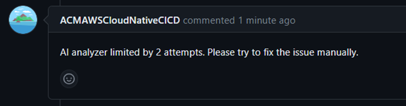

<h1 align="center"> Terraform issue handler </h1>

**Goal:** Since Terraform is a part of Atlantis service we were able to integrate an automatic error handler of Terraform issues with AI.

## Description

It has the following steps:

1) Install the Python virtual environment and switch on it

2) Install Python requirements for AI handler script

3) Run terraform validate/plan/apply and save the error in the error log if such happened

4) If the AI_HANDLER  environment variable is set up and the error log is not empty we execute the script of AI

5) The result will be in the Pull Request comment and additionally a new branch with the prefix name and a new pull request

6) We run Atlantis plan automatically from the new pull request and if the error we create a new branch with the prefix in the name, a new pull request

7) In the script responsible for that we restrict it to 3 iteration


## Atlantis integration

```
workflows:
  terragrunt: #================= Terragrunt Workflow =============================#
    plan:
      steps:
        .........
        #########
        .........
        - env:
            name: OPENAI_TOKEN
            command: 'aws ssm get-parameter --name "/accelerator/openai_token" --with-decryption | jq .Parameter.Value -r'
        - env:
            name: GITHUB_TOKEN
            command: 'aws ssm get-parameter --name "/atlantis/github/user/token" --with-decryption | jq .Parameter.Value -r'
        - env: # If we enable AI Handler
            name: AI_HANDLER
            value: 0
 
################################
 
        - run: pip3 install virtualenv && python3 -m venv error_handeling
        - run: git -v
        - run: source error_handeling/bin/activate && echo $VIRTUAL_ENV
        - run: pip3 install -r /home/atlantis/.atlantis/repos/${BASE_REPO_OWNER}/${BASE_REPO_NAME}/${PULL_NUM}/${WORKSPACE}/scripts_ai/requirements.txt
        - run: terragrunt validate -no-color 2> error_raw.log || cat error_raw.log | grep -v "validate_tflint" > error.log
        - run: if [ -s "error.log" ];
            then
            echo "Error log print" && cat error.log;
            fi
        - run: if [ $AI_HANDLER == 1 ] && [ -s "error.log" ];
            then
            echo "Validate issue. Checking with OpenAI" && python3 /home/atlantis/.atlantis/repos/${BASE_REPO_OWNER}/${BASE_REPO_NAME}/${PULL_NUM}/${WORKSPACE}/scripts_ai/ai_analyzer.py && exit 1;
            fi
        - run: terragrunt plan -out $PLANFILE $DESTROY_PARAMETER -no-color 2> error_raw.log || cat error_raw.log | grep -v "validate_tflint" > error.log
        - run: if [ -s "error.log" ];
            then
            echo "Error log print" && cat error.log;
            fi
        - run: if [ $AI_HANDLER == 1 ] && [ -s "error.log" ];
            then
            echo "Plan issue. Checking with OpenAI" && python3 /home/atlantis/.atlantis/repos/${BASE_REPO_OWNER}/${BASE_REPO_NAME}/${PULL_NUM}/${WORKSPACE}/scripts_ai/ai_analyzer.py;
            fi ........
########
........
    apply:
      steps:
...........
###########
...........
        - run: terragrunt apply $PLANFILE -no-color 2> error_raw.log || cat error_raw.log | grep -v "validate_tflint" > error.log
        - run: if [ -s "error.log" ];
            then
            echo "Error log print" && cat error.log;
            fi
        - run: if [ $AI_HANDLER == 1 ] && [ -s "error.log" ];
            then
            echo "Apply issue. Checking with OpenAI" && python3 /home/atlantis/.atlantis/repos/${BASE_REPO_OWNER}/${BASE_REPO_NAME}/${PULL_NUM}/${WORKSPACE}/scripts_ai/ai_analyzer.py;
            fi
```

## Necessary environment variables

**OPENAI_TOKEN** - read a token value of AI (currently OpenAI) from AWS SSM

**GITHUB_TOKEN** - read a token of GitHub repository from AWS SSM

**AI_HANDLER** - enable/disable AI Handler


## Install Python virtual environment 
Install Python virtual environment with the name error_handeling and switch on it

```
pip3 install virtualenv && python3 -m venv error_handeling
```

## Run Terragrunt validate/plan/apply with additional options

```
terragrunt apply $PLANFILE -no-color 2> error_raw.log || cat error_raw.log | grep -v "validate_tflint" > error.log
```
## Save error output in the file
```
2>error_raw.log
```

## Exclude tflint specific key-word
If the error of terragrunt happened (the command unsuccessful) we print the error log in the terminal and since we have a tflint tool which is now a part of terraform code we must remove a specific key-word "validate_tflint" from the error log since tflint leaves it each time it runs.

```
|| cat error_raw.log | grep -v "validate_tflint" > error.log
```

## Check AI_HANDLER environment variable
Check the error log if it is empty and an environment variable AI_HANDLER  is set to 1
Print the message and run the Python script ai_analyzer.py

```
- run: if [ $AI_HANDLER == 1 ] && [ -s "error.log" ];
            then
            echo "Apply issue. Checking with OpenAI" && python3 /home/atlantis/.atlantis/repos/${BASE_REPO_OWNER}/${BASE_REPO_NAME}/${PULL_NUM}/${WORKSPACE}/ai_analyzer.py;
            fi
```

## Diagram



## Results
- Overall view of the error





- The script reads a full file path (here: ../alb_deploy/alb.tf), the error by itself, and the module path since all of our terraform files reside in the modules.





- We print the correct file example in a PR comment (can be disabled)





- We create a new branch with a prefix and a PR from it







- Changed file/files can be found in a proper PR tab







- Run Atlantis validate/plan/apply again and check if the error exists

If exist we create a new branch and PR with -002 prefix




- Run Atlantis validate/plan/apply again and check if the error exists

If exists we create a new branch but this action will be rejected since we restrict it by the script up to 2 iteration


