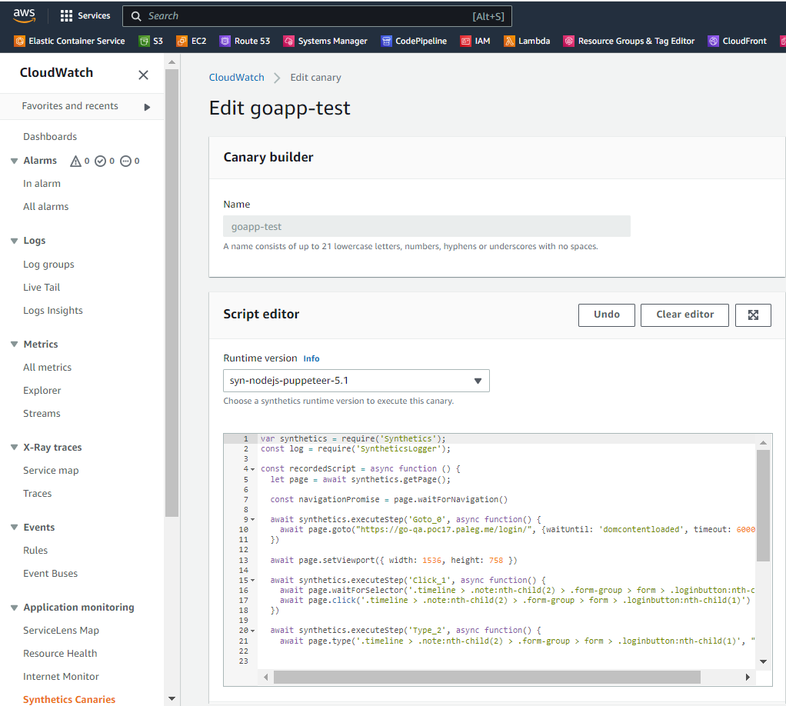

<h1 align="center"> Amazon CloudWatch Synthetics </h1>

## About AWS Synthetics

You can find all the necessary information here: [https://docs.aws.amazon.com/AmazonSynthetics](https://docs.aws.amazon.com/AmazonSynthetics/latest/APIReference/Welcome.html).

1. Deploy `synthetics` module:
   * To create AWS CloudWatch Synthetics you need set `synthetics_create = true`. It includes [synthetics](../modules/accelerator/synthetics) module to apply.
   * To manage Synthetics from AWS Codepipeline module `synthetics` creates `Synthetics Canary`, `Start Canary Lambda`, `Check Canary Status Lambda`, `Get Canary Results Lambda`.
   * To manage lambdas from CodePipeline we use `Step Function`

2. After deploying `synthetics` module we can change `Synthetics` testing script from AWS Console:

   

3. To create `Synthetics` script is used the `CloudWatch Synthetics Recorder for Google Chrome` plugin, for more information see [here](https://docs.aws.amazon.com/AmazonCloudWatch/latest/monitoring/CloudWatch_Synthetics_Canaries_Recorder.html#CloudWatch_Synthetics_Canaries_Recorder-using).
4. If `Sintetics Canary` test is passed, AWS CodePipeline goes on further.