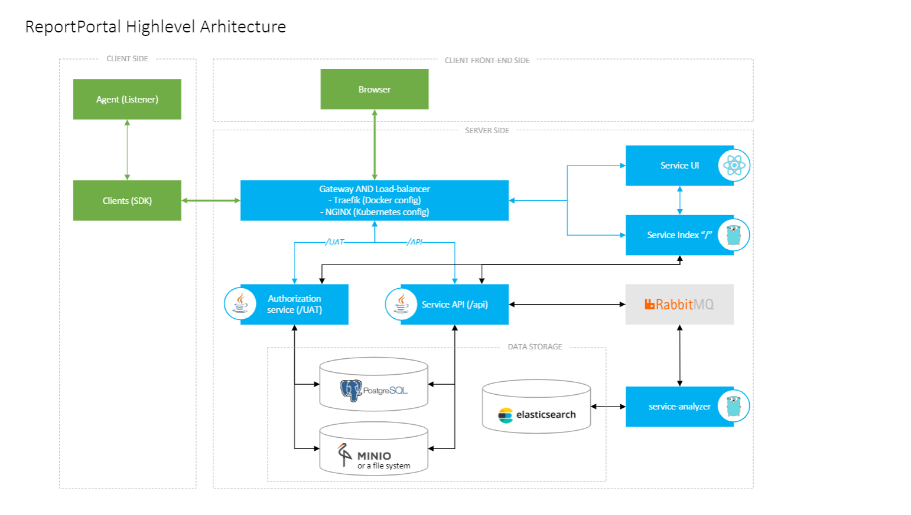
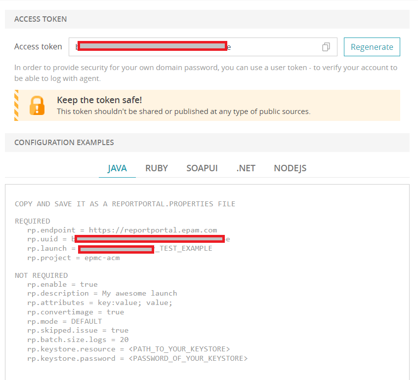
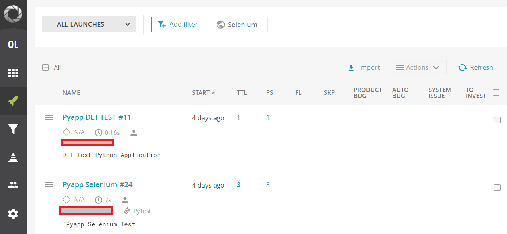

<h1 align="center"> Report Portal </h1>

* [Architecture overview](./Report_Portal.md#architecture-overview)
* [3 easy steps to get started with ReportPortal](./Report_Portal.md#3-easy-steps-to-get-started-with-ReportPortal)
* [Integration with AWS Accelerator](./Report_Portal.md#integration-with-AWS-Accelerator)
* [Integration examples for supported languages](./Report_Portal.md#integration-examples-for-supported-languages)
   * [Java](./Report_Portal.md#java)
   * [Python](./Report_Portal.md#python)
   * [Golang](./Report_Portal.md#golang)
  

## Architecture overview

ReportPortal is a service that provides increased capabilities to speed up results analysis and reporting using built-in analytic features.
ReportPortal is a great addition to Continuous Integration and Continuous Testing process.
Report Portal organized into multiple repositories.
Application Core is based on micro-services architecture and includes the following mandatory services: structure

## 3 easy steps to get started with ReportPortal

You can find all the necessary information [here](https://reportportal.io/installation).

##  Integration with AWS Accelerator

You need to access the Report portal and find out the configuration parameters required for connection.
 

- Put [scripts](../docs/template_config_files/scripts) folder to the application repository.
- Write values for the Report Portal token `rp_token` to the file [app_parameter_store_example.hcl](../terragrunt-infrastructure-example/accelerator/accounts/accelerator/regions/example/setup_folder/applications/example/app_parameter_store_example.hcl).
- rp_token_name = "" # The path for the ReportPortal token in the AWS ParameterStore will be defined automatically.
- rp_project    = "my_rp_project" # Name of a project in ReportPortal.
- rp_endpoint   = "https://reportportal.epam.com" # ReportPortal endpoint URL.
- In the [scripts](../docs/template_config_files/scripts) directory for application in [sonar](../docs/template_config_files/scripts/sonar) and [selenium_tests](../docs/template_config_files/scripts/selenium_tests) folders define all variables for Pytest in `pytest.ini` file.

## Integration examples for Unit Test supported languages
### Java
* [examples for Java](https://github.com/reportportal/examples-java)
* [client for Java](https://github.com/reportportal/client-java)

### Python
* [client for Python](https://github.com/reportportal/client-Python)
* [Pytest](https://github.com/reportportal/agent-python-pytest)

### Golang
* [client for Golang](https://github.com/reportportal/goRP)

After all the modifications to the program, you will see a similar picture in the Report Portal console.

