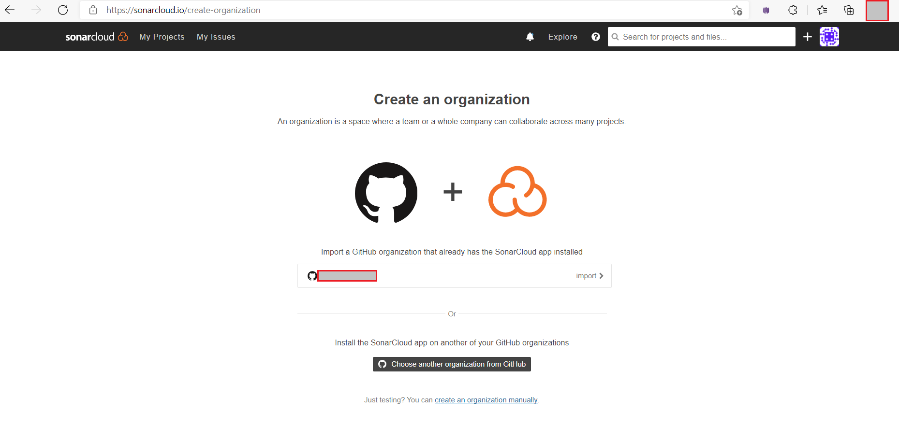
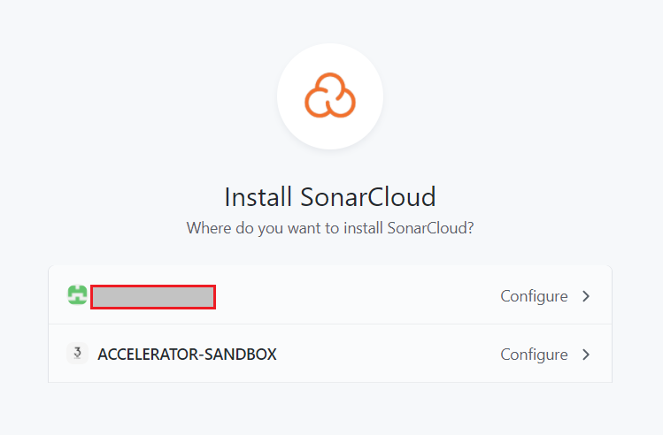
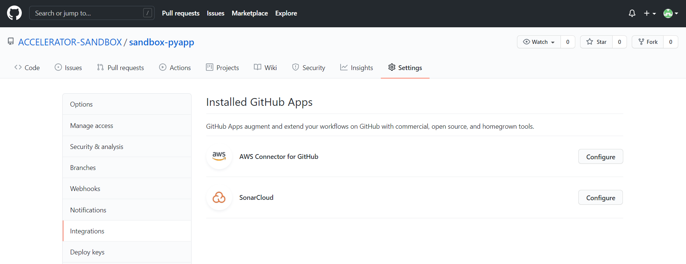
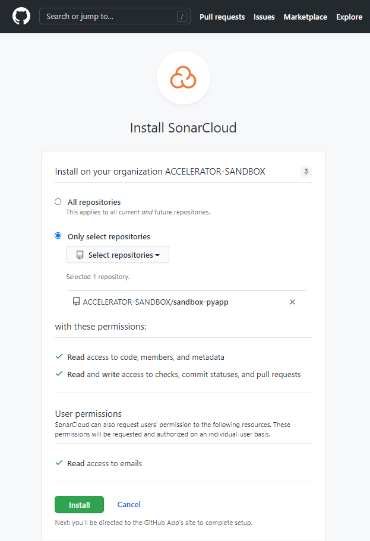
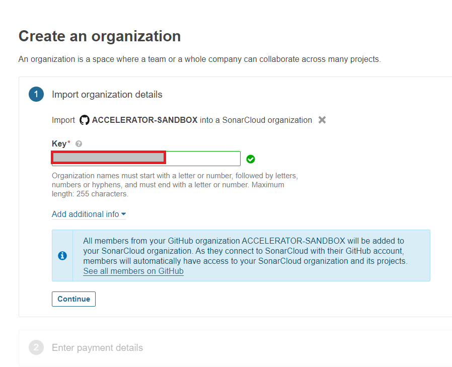
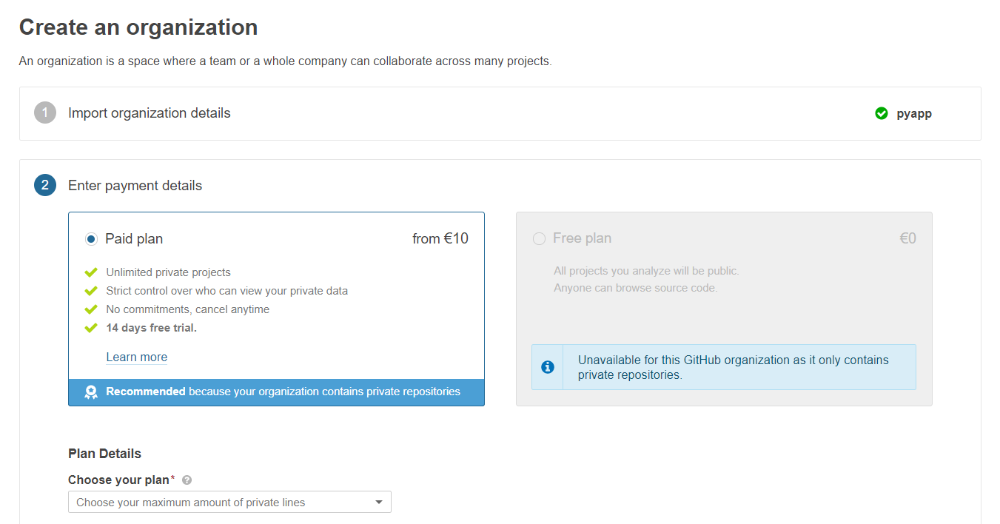
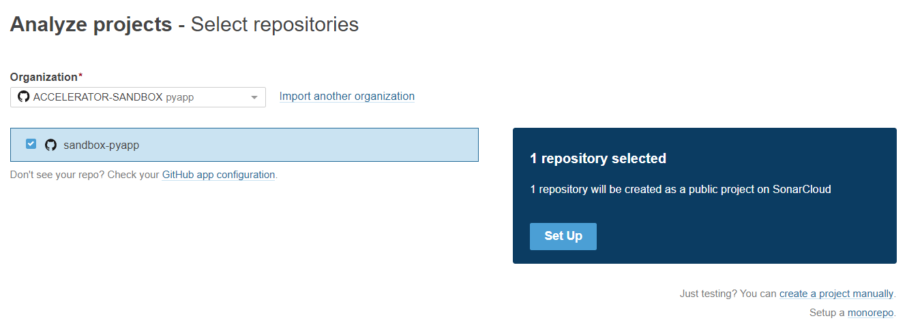
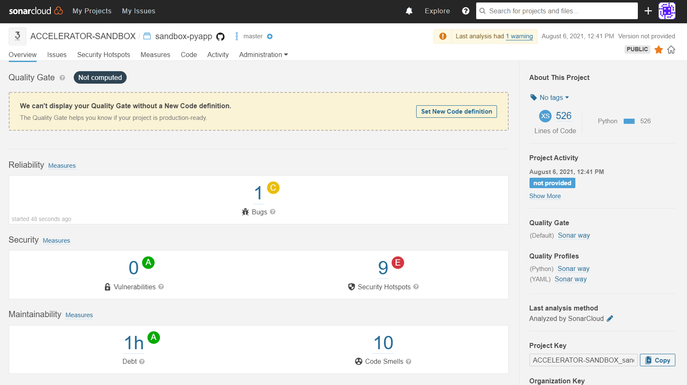

<h1 align="center"> SonarCloud configuration </h1>

To transfer data to `SonarCloud`, some configuration needs to be done on the `SonarCloud` and `VCS` side. First, you must sign in to `SonarCloud` using your `VCS` account and authorize your SonarCloud organization. You can now add the GitHub organization you are using to SonarCloud by clicking the + next to your account.

SonarCloud will be installed as a GitHub App for that organization.

Please check if the SonarCloud app is installed in your organization on GitHub yourself or have the admin check it for you.

Then you need to give SonarCloud access to your repository.

In SonarCloud you can now create an organization.

And choose a plan for this.

Then start to analyze a new project.

If everything is ok, you should be able to see something like this.

For a more complete setup of SonarCloud, refer to the [official documentation](https://sonarcloud.io).

After this step, put the file [buildspec_sonar.yml](template_config_files/buildspec_sonar.yml) to the root of the application repository.

Define all variables for `Sonar` in [env.hcl](../terragrunt-infrastructure-example/accelerator/accounts/accelerator/regions/example/setup_folder/applications/example/env.hcl) file and `sonarcloud_token` in [app_parameter_store.hcl](../terragrunt-infrastructure-example/accelerator/accounts/accelerator/regions/example/setup_folder/applications/example/app_parameter_store_example.hcl) file.
