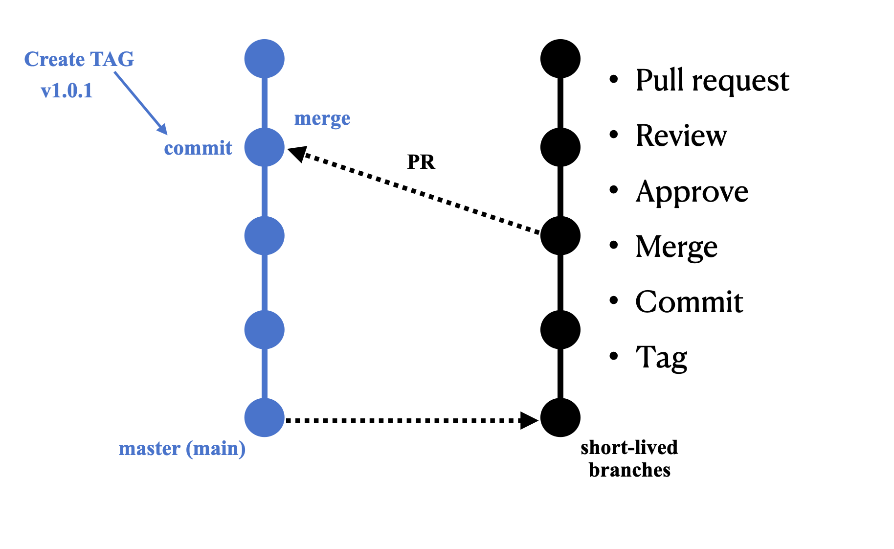

<h1 align="center"> Versioning </h1>

[Automatic Tagging Process](#automatic-tagging-process)<br>
[Manual Tagging Process](#manual-tagging-process)<br>
[Version Synchronization](#version-synchronization)<br>
[Docker Build Specification](#docker-build-specification)<br>
[Docker Image Configuration](#docker-image-configuration)<br>

## About Versioning

Application versioning plays a pivotal role in managing software changes, enhancements, and releases effectively. It facilitates streamlined collaboration among developers, simplifies debugging processes, and enables efficient rollback mechanisms in case of unforeseen issues.

In our development approach, we have embraced a semantic versioning (SemVer) strategy - https://semver.org/. This entails the following version numbering scheme: "MAJOR.MINOR.PATCH," where:

- **MAJOR** version signifies significant changes that might result in compatibility breaks.
- **MINOR** version denotes the addition of new features or enhancements without disrupting existing functionality.
- **PATCH** version indicates bug fixes or minor improvements that retain backward compatibility.

By adopting the SemVer strategy, we ensure transparent communication of changes, while maintaining backward compatibility. This choice fosters an organized and sustainable development environment, allowing us to deliver high-quality software with greater clarity and coherence.

Here's our schema of how this operates:
1. Commit to the main branch - Automatically generates a new tag.
2. Git tag number = Docker image tag.
3. Utilize Git tags in place of commit numbers.



# Versioning Process Using Tags
## Automatic Tagging Process:

When you commit changes to the main branch of the repository, a new tag is automatically generated to reflect your application's version. This process simplifies version management and change tracking.

How Automatic Tagging Works

When changes are committed to the main branch (typically 'main' or 'master'), the system automatically creates a new tag with an incremented application version. This version is calculated by increasing the last version number by 1, following the semantic versioning (SemVer) format vX.Y.Z, where X, Y, and Z are numerical values. The new tag is associated with the current commit in the repository and is displayed in the list of tags.

## Manual Tagging Process:

If manual tagging is required, follow these steps:

1. Create a new tag that adheres to the semantic versioning format vX.Y.Z, where X, Y, and Z are numbers representing major, minor, and patch versions respectively.
2. Ensure that the tag has the prefix "v", for example, v1.2.3.
3. Attach the created tag to the latest commit in the repository.

**Note:** Automatic tagging offers a more convenient and precise approach to managing application versions. It is recommended to use this method to maintain version sequencing and automate the process.

As a result, with each new commit to the main branch of the repository, a new tag is automatically created with an incremented version of your application. This facilitates tracking and controlling changes effectively.

# Docker Image Versioning 
## Matching git version tag and docker image tag:

When building a Docker image, the application version is automatically propagated, ensuring alignment between the Docker image version and the corresponding Git repository version. This practice enhances version consistency and aids in maintaining a clear and organized development process.

## Docker Build Specification:
In the docker_buildspec.yml file, you'll find a command:
```yaml
docker build -t $AWS_ACCOUNT_ID.dkr.ecr.$AWS_REGION.amazonaws.com/$IMAGE_REPO_NAME:$new_tag --build-arg APP_VERSION=$new_tag .
```

This command is responsible for creating a Docker image and assigning it the same label (tag) as the tag in your Git repository. This ensures alignment between the version of the Docker image and the Git repository version. In other words, when creating a Docker image, it is labeled with the same version as the Git repository tag, allowing the image and code to be linked together.

This practice enhances version consistency and helps maintain a clear and organized development process.

## Docker Image Configuration:
The Docker image includes the following configuration:
```
ARG APP_VERSION
ENV APP_VERSION=$APP_VERSION
```
During Docker image creation, the application version is passed, resulting in an environment variable storing the current application version. Developers can utilize this variable to establish an endpoint (e.g., /version) that displays the current deployed application version. This enables easy identification of the code version (commit) in the Git repository and the deployed application version.