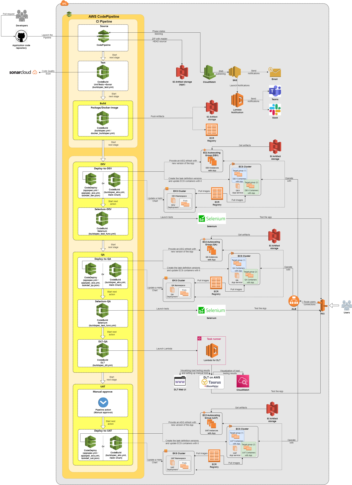

<h1 align="center"> CI/CD pipeline on native AWS services </h1>

* [Continuous Integration](./cicd.md#continuous-integration)
* [Continuous Delivery](./cicd.md#continuous-delivery)
  * [DEV stage](./cicd.md#dev-stage)
  * [QA stage](./cicd.md#qa-stage)
  * [UAT stage](./cicd.md#uat-stage)
  * [CD to Kubernetes Cluster](./cicd.md#deploy-to-kubernetes-cluster)
* [Further reading](./cicd.md#further-reading)

<hr>

Continuous Integration flow is implemented using the following:
* `CodePipeline`, as a tool for following the applied code changes.
* `CodeBuild`, as a managed continuous integration service that compiles source code, runs tests, and produces software packages/containers.

Continuous Delivery flow is implemented using the following:
* `CodePipeline`, as a tool for constant application of code changes
* `CodeDeploy`, for Application deploying
* `CodeBuild` for update Application in EKS Cluster

At the moment `Bitbucket`, `CodeCommit`, `GitHub` and `GitLab` can be used as code hosting and collaboration platforms.

<h4 align="center"> CI/CD pipeline concept </h4>

 

## Continuous Integration

`CodePipeline` is configured to automatically start the CI/CD pipeline when a change occurs in the source code in the branch that you specified. CI Pipeline has the following actions defined:
1.	`Source` - when change is detected, `CodePipeline` creates a ZIP archive with current HEAD snapshot of the main branch and uploads it into the artifact storage S3 bucket (`source/` prefix).
2.	`Sonar Test` - performs code quality checks with `SonarCloud`, full information for integration see [here](SonarCloud_configuration.md) 
3.  `Unit Test` - unit testing
4.  `Build` (`Package`/`Docker-Image`)
    - **For deployment on EC2**: We support `Java`, `Golang`, or `Python` languages to pack an application code into `deb package`, and upload it into artifact storage `S3` bucket (`packaged/` prefix). It is configured [buildspec.yml](./template_config_files/buildspec.yml). A custom [script](../modules/accelerator/accelerator_storages/storage_bucket_files/pack_to_deb.sh) that is uploaded to the `S3` bucket.
    -  **For deployment with docker** we use [buildspec_docker.yml](./template_config_files/buildspec_docker.yml)  in the application repo.

## Continuous Delivery
### DEV stage

1.	The `Deploy-to-DEV` action starts after receiving a signal about the start of a stage. It launches the container with `CodeDeploy` to deploy the Application on the `EC2 instance` from the `deb package`, or to `ECS Service` with a new Docker Image. It is configured in [appspec.yml](./template_config_files/appspec.yml) or [appspec_ecs.yml](./template_config_files/appspec_ecs.yml) from the application repo.

### QA stage

**1**. The `Deploy-to-QA` action starts after receiving a signal about the start of a stage. It launches a container with the `CodeDeploy` to deploy the Application on the EC2 instance from the deb package or to `ECS Service` with a new Docker Image. It is configured in [appspec.yml](./template_config_files/appspec.yml) or [appspec_ecs.yml](./template_config_files/appspec_ecs.yml) from the application repo.

**2**. For **functional** tests, we can use several testing instruments:

1. ***Selenium***: set `selenium_create = true`. An action on `QA` stage with Selenium test will be created.
     * For running tests from AWS Codepipeline we use [buildspec_selenium.yml](./template_config_files/buildspec_selenium.yml). **Put it to your application repo.** 
     * Your Selenium tests write in [selenium_tests.py](template_config_files/scripts/selenium_tests/selenium_tests.py). **Put folder [scripts](template_config_files/scripts/) to your application repo.**
     * `PASS_RATE` - defines a threshold percent, based on which test can be considered as passed. When pass rate condition is not met, the `CodeBuild` job fails.

2. ***AWS Synthetics***: set `synthetics_create = true`. An action on `QA` stage with Synthetics test will be created.
     * [Synthetics module](../modules/accelerator/synthetics) will be deployed.
     * For more information read [here](AWS_Synthetics.md)
  
**3**. For **performance** tests, we can use several testing instruments:

1. ***Distributed Load Testing on AWS(DLT)***: set `dlt_create = true`

  * The AWS's [Load Testing Solution](https://docs.aws.amazon.com/solutions/latest/distributed-load-testing-on-aws/welcome.html) has been implemented.
  * We modified the CloudFormation stack file [dlt.yml](../features/storage_bucket/dlt.yml) for our needs to integrate it into AWS CodePipeline.
  * CloudFormation Stack is deployed automatically upon creating the `CodePipeline` project resources.

- Other configuration files will be used when the application pipeline stage starts:
  * `CodeBuild` buildspec file [buildspec_dlt.yml](../docs/template_config_files/buildspec_dlt.yml). 
  * Application-specific scripts: [dlt_test.py](template_config_files/scripts/dlt/dlt_test.py) 
  * For more information follow this [link](../docs/dlt.md).

- Testing parameters are set in `buildspec_dlt.yml`:   
  *  `EXPECT_SUCCESS_RATE` - defines a threshold percent of passed tests, based on which test can be considered as passed. When the pass rate condition is not met, the CodeBuild job fails
  *  `SUCCESS_P95` - defines the 95th percentile response rate threshold, in seconds, at which the test can be considered a pass. When the pass rate condition is not met, the `CodeBuild job` fails. If all steps are completed successfully, this acts as a quality checkpoint before the manual approval action.


2. ***CARRIER*** set `carrier_create = true`:

  * You can find all the necessary information [here](https://getcarrier.io/#about).

  * After Carrier is deployed and testers set up a test environment on it, we can run these tests from AWS CodePipeline.
  * To run test we use docker command with variables:
    ```bash
    docker run -e galloper_url=${galloper_url} -e project_id=${project_id} \
    -e token=${auth_token}  getcarrier/control_tower:2.5 --test_id=${test_id}
    ```
  * `CodeBuild` buildspec file [buildspec_carrier.yml](template_config_files/buildspec_carrier.yml). 
  
### UAT stage

1.	When the user approves the deployment manually.
2.	The `CodeBuild` from `Manual-Approve` action starts after receiving a signal about the start of the stage, it starts/aborts the next action.
3.	The `Deploy-to-UAT` action starts after receiving a signal about the manual approval. It launches a container with `CodeDeploy` to deploy the Application on the EC2 instance from the deb package or to `ECS Service` with a new Docker Image. It is configured in [appspec.yml](./template_config_files/appspec.yml) or [appspec_ecs.yml](./template_config_files/appspec_ecs.yml) from the application repo. The app is ready for production use.

### Deploy to Kubernetes Cluster
* We use AWS Codebuild on each stage to update Helm chart. 
* You need to put [buildspec_eks.yml](../docs/template_config_files/buildspec_eks.yml) in the root of the application repository and [folder kubernetes](..docs/template_config_files/scripts/kubernetes/) to the scripts folder.
* In the [env.hcl](../terragrunt-infrastructure-example/accelerator/accounts/accelerator/regions/example/setup_folder/applications/example/env.hcl) define `target_type = "eks" or "kube_cluster"`
* Depending on the cluster define all variables for Kubernetes accordingly.
* *Important notice:* `buildspec_eks.yml` file is filled depending on Helm Chart and type of the Cluster.
#### Working with Kubernetes Cluster
* To get all variables from a cluster administrator needed for Helm Chart
* To get access to Helm Repository, in our example we store Helm Chart on AWS S3 Bucket
* To get access to the control plane the cluster(to give permissions AWS Codebuild Role or get `user kubeconfig` of the cluster with right permissions) 
* To add variables to AWS Codebuild in terraform code
* To add sensitive variables to the AWS Parameter Store


## Further reading

* [Application environments](../docs/app-envs.md)
* [Notifications](../docs/notifications.md)
* [Pull Request Analysis](../docs/PRanalysis.md)

#### [Main page](../README.md)
