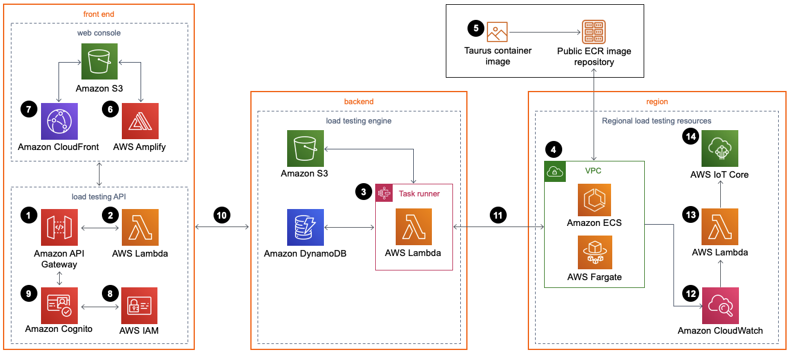
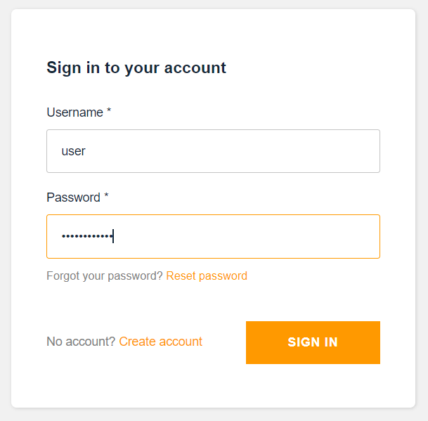
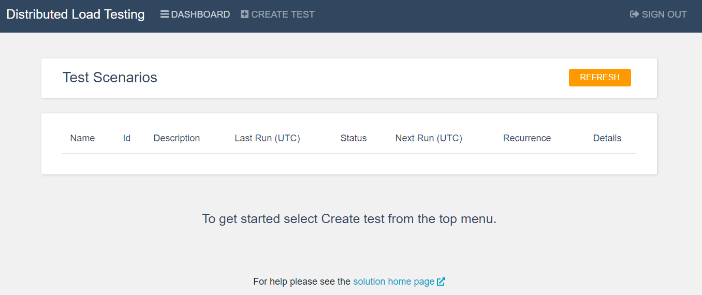
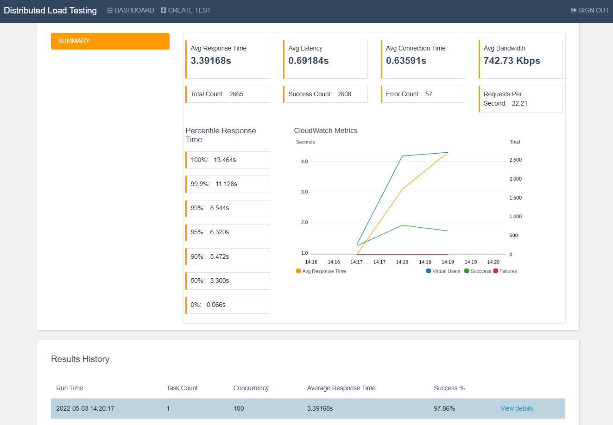

<h1 align="center">  Distributed Load Testing on AWS provisioning </h1>

### Architecture overview
We deploy this solution with some additional outputs and changes for our AWS Codepipeline needs in the AWS Cloud.

#### Distributed Load Testing on AWS architecture

More information can be found at the [distributed-load-testing-on-aws](https://docs.aws.amazon.com/solutions/latest/distributed-load-testing-on-aws/welcome.html).

### DLT deployment
  
1. The CloudFormation [dlt.yml](../modules/accelerator/accelerator_storages/storage_bucket_files/dlt.yml) stack file is stored in `storage_bucket` created during `core` deployment.
2. To run the DLT CF stack deploy, define `dlt_create` variable as `true` in [env.hcl](../terragrunt-infrastructure-example/accelerator/accounts/accelerator/regions/example/core/env.hcl)
3. After the DLT infrastructure is created, you receive the email specified in the configuration when the infrastructure was raised. It contains a link to the console, username and initial password required for initial login and password change.

   
  
4. Now you must change the password to a new one, set the password you have defined for the Parameter Store variable `cognito_password` in [parameter_store.hcl](../terragrunt-infrastructure-example/parameter_store_example.hcl).
5. After that, you will be taken to the console.

   
  
### Usage from AWS CodePipeline
1. Testers creates test from DLT WEB interface. It can be two types: `Simple` and `JMeter`
2. Pass the parameters of the test to the CI/CD [env.hcl](../terragrunt-infrastructure-example/accelerator/accounts/accelerator/regions/example/setup_folder/applications/example/env.hcl) file.
3. The test will be run from AWS CodePipeline. You can change some of the parameters of the test using variables. 
4. As soon as the pipeline runs CodeBuild in the DLT-QA stage, you will see the test result. You can also find a link to the console at the end of the CodeBuild log.
5. Configuration files:
   * CodeBuild's buildspec file [buildspec_dlt.yml](../docs/template_config_files/buildspec_dlt.yml). To satisfy your conditions, you need to change the parameter values (EXPECT_SUCCESS_RATE, SUCCESS_P95). First, it is the desired percentage of the successful passage of quality gates. The second is the preferred test time for the 95th percentile.
   * Application-specific script [dlt_test.py](../docs/template_config_files/scripts/dlt/dlt_test.py). You can change some parameters of a test using variables.
6. You can see results of tests in DLT WEB Interface:

    