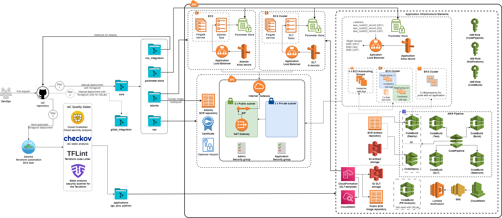

<h1 align="center"> Infrastructure deployment </h1>



### There are two steps of infrastructure deployment:
* [Manual](./infra.md#manual)
* [Semi-automatic](./infra.md#semi-automatic)

### Manual 
* #### Managed by a user using CLI tools (`AWS CLI`, `Docker`, `Terraform`, and `Terragrunt` need to be installed)
* #### This step deploys terraform modules:
  - [vpc](../modules/core/vpc) ,
  - [atlantis](../modules/core/atlantis) , 
  - [parameter-store](../modules/core/parameter-store) - Parameter Store variables for Atlantis,
  - [atlantis_vcs_integration](../modules/core/atlantis_vcs_integration)
  - [distributed_load_testing](../modules/core/distributed_load_testing)
  - [template_module](../modules/core/template_module)

#### Terragrunt implementation:

- Terragrunt folders structure looks like that:
 
  **accelerator-infrastructure** 
    - _envcommon
    - accounts
      - accelerator
        - regions
          - region
            - core 
            - setup_folder
            - applications
              - application-1
                - ci-cd
              - application-2
                - ci-cd
  - **application-infrastructure**
    - _envcommon
    - application
      - accounts
        - dev(`If stages are deployed at the same account, you can join them`)
          - regions
            - region
              - cross-account-integration
              - infrastructure-module
        - qa
          - regions
            - region
              - cross-account-integration
              - infrastructure-module
        - uat
          - regions
            - region
              - cross-account-integration
              - infrastructure-module

* In [**accelerator**](../terragrunt-infrastructure-example/accelerator/accounts/accelerator) folder we deploy manually:
  1. All folders in [core](../terragrunt-infrastructure-example/accelerator/accounts/accelerator/regions/example/core) directory.
  2. Make a customization process to deploy the entire folder structure for application needs (CI/CD and application infrastructure) [setup_folder](../terragrunt-infrastructure-example/accelerator/accounts/accelerator/regions/example/setup_folder)
* Deploy using Atlantis:
  1. Application infrastructure from [application-infrastructure](../terragrunt-infrastructure-example/application-infrastructure) directory.
  2. CI/CD for an application from [applications](../terragrunt-infrastructure-example/accelerator/accounts/accelerator/regions/example/setup_folder/applications) directory.
### Deployment steps
#### 1. First step
 - In [terragrunt-infrastructure-example](../terragrunt-infrastructure-example) rename `example` for **folder** and **region** 
 - In [common.hcl](../terragrunt-infrastructure-example/common.hcl) define common variables.
#### 2. Core
- After this step, we will have next infrastructure: *VPC*, *Atlantis*, *GIT WebHook connected with Atlantis*, [*DLT*](https://aws.amazon.com/solutions/implementations/distributed-load-testing-on-aws/) 
1. In [region.hcl](../terragrunt-infrastructure-example/accelerator/accounts/accelerator/regions/example/region.hcl) define the `region`
2. In [account.hcl](../terragrunt-infrastructure-example/accelerator/accounts/accelerator/account.hcl) define `account`
3. Change [parameter_store_example.hcl](../terragrunt-infrastructure-example/parameter_store_example.hcl) to `parameter_store.hcl`. Define all variables. **Don't push this file to the Git Repository.**
4. Define account, region and all variables in `account.hcl`, `region.hcl` and `env.hcl` accordingly.
5. Run `terragrunt run-all plan` and then `terragrunt run-all apply` from the [**core**](../terragrunt-infrastructure-example/accelerator/accounts/accelerator/regions/example/core) directory.

#### 3. SetUp Folders Structure	
- After this step, we will have all folders and files for deploying CI/CD and application's infrastructure.
1. Change `example` [setup_folder/applications/example](../terragrunt-infrastructure-example/accelerator/accounts/accelerator/regions/example/setup_folder/applications/example) with the name of you application repository name.
2. Change [app_parameter_store_example.hcl](../terragrunt-infrastructure-example/accelerator/accounts/accelerator/regions/example/setup_folder/applications/example/app_parameter_store_example.hcl) to `app_parameter_store.hcl`
3. Define all *secret* variables in the file. If your application is stored on `GitLab` define variables for `GitLab Integration`. **Don't add this file to Git**. 
4. Define all variables in [env.hcl](../terragrunt-infrastructure-example/accelerator/accounts/accelerator/regions/example/setup_folder/applications/example/env.hcl). *Don't change automatically defined variables block* 
5. Run `terragrunt run-all plan` and `terragrunt run-all apply` from the [setup_folder/applications/example](../terragrunt-infrastructure-example/accelerator/accounts/accelerator/regions/example/setup_folder/applications/example) directory.
6. If your application is store on GitLab, put [.gitlab-ci.yml](./template_config_files/.gitlab-ci.yml) to the root of your GitLab repository for application. It will start GitLab CI/CD Pipeline to mirror the GitLab repo to AWS CodeCommit.

#### 4. Cross-account Integration 
- Create cross-account roles to give Atlantis permissions to manage infrastructure in other accounts.
    
  1. *Cross-Account Role for Atlantis:*
     - Run `terragrunt apply` from the `cross-account-integration` directory under [application-infrastructure](../terragrunt-infrastructure-example/application-infrastructure). 
     - Put **ARN** of the role to `account.hcl` file with variable `assume_role_arn`. The Atlantis will use the role to apply application infrastructure in different account.
     - **By default, we give admin permission to the role.** 

### Semi-Automatic
##### 1. Application Infrastructure

1. After `SetUp Folders Structure` step we have directories with folders for application infrastructure for stages.
2. Recheck all variables in `account.hcl` and `region.hcl`. Complete defining of variables in `env.hcl` file for  each stage.
3. In the [atlantis.yaml](../atlantis.yaml) file, for managing folders you need to deploy, set `enabled: true` or `false` in the template blocks:
    ```yaml
    projects:
       - &template_ci_cd
         dir: template_ci_cd
         workflow: terragrunt
         autoplan:
           enabled: true
           when_modified:
             - "../../../../../../../../../modules/accelerator/**/*.tf"
             - "**/*.hcl"
       - &template_infra
         dir: template_infra
         apply_requirements: [approved]
         workflow: terragrunt
         autoplan:
           enabled: true
           when_modified:
             - "../../../../../../../modules/application-infrastructure/**/*.tf"
             - "**/*.hcl"
   ```
4. Create a block with the path to your [infrastructure-module](../terragrunt-infrastructure-example/application-infrastructure) folder 
  
     ```yaml
        - <<: *template_infra
          dir: terragrunt-infrastructure-example/application-infrastructure/example/dev/regions/eu-central-1/infrastructure-module
     ```
   Define the Git branches that Atlantis should work with:
      ```yaml
         workflows:
          terragrunt: #================= Terragrunt Workflow =============================#
            plan:
              steps:
                - env:
                    name: BASE_BRANCH_NAME
                    value: master
                - env:
                    name: HEAD_BRANCH_NAME
                    value: develop
      ```
5. Push the changes to the repository. Atlantis will create a pull request and run the `terragrunt plan` command.
6. If the plan output is good, comment `atlantis apply`, and Atlantis will execute the `terragrunt apply` command.
    
#### 2. Accelerator CI/CD
1. After `SetUp Folders Structure` step we have a folder for `CI/CD` in the [applications](../terragrunt-infrastructure-example/accelerator/accounts/accelerator/regions/example/applications) directory.
2. Recheck all variables in `env.hcl` file.
3. In the [atlantis.yaml](../atlantis.yaml) file, create a block with the path to the `ci-cd` folder:

   ```yaml
        - <<: *template_ci_cd
          dir: terragrunt-infrastructure-example/accelerator/accounts/accelerator/regions/eu-central-1/applications/<your_name>/ci-cd
   ```
        
4. Push the changes to the repository. Create a pull request and the Atlantis will run the `terragrunt plan` command.
5. If the plan output is good, comment `atlantis apply`, and Atlantis will execute the `terragrunt apply` command.

### Post deployed actions

1. Go to AWS Console Pipeline Section and approve AWS CodeStar Connection
2. Make changes in your application repository, push to your repository, AWS CodePipeline will start.


### Atlantis flow:

Currently, the following flow, described in [atlantis.yaml](../atlantis.yaml), is used:
1. `Atlantis` **plan** run is triggered automatically by raising pull request into branch you specified and includes the following steps:
    * `terragrunt validate`
    * `terragrunt plan -out $PLANFILE $DESTROY_PARAMETER`
    * testing Terraform code with `Checkov`, `TFSec` or `Regula`: define env value `0` or `1` accordingly
    * **to process terraform errors from resources configuration with Open AI** set env `AI_HANDLER` to `1`, see [terraform_issue_handler](../docs/AI/terraform_issue_handler.md)
    * `Infracost` estimates the cost of the planned infrastructure
    * **to destroy infrastructure** is used `$DESTROY_PARAMETER` and command `atlantis plan -d path/to/directory -- -destroy`
2. If there are no errors in the previous step, the following steps:
    * comment `atlantis apply -d path/to/directory` in PR and `Atlantis` will **apply** changes in PR to the existing infrastructure
    * testing AWS infrastructure with `Cloud Custodian` with rules described in [custodian.yml](../custodian.yml) or runs [custodian.sh](../custodian.sh) if we use EPAM Custodian
3. If changes are applied successfully, PR is **merged** to the branch being specified.

**TODO**: Current implementation allows repos to define their own workflows. It means that anyone can create a pull request to the repo and essentially run arbitrary code on the `Atlantis` server. To prevent that:
* [custom workflow code](../atlantis.yaml) must be moved to the [Atlantis Server Side Repo Config](../modules/core/atlantis/repos.yaml)
* `allow_custom_workflows` must be disabled.

**TODO**: `Cloud Custodian` currently has just one stub rule to demonstrate usage feasibility.


## Further reading

* [CI/CD](./cicd.md)
* [Application environments](../docs/app-envs.md)
* [Supported Linters and Static Code Analysis tools for Terraform](../docs/linters.md)

#### [Previous page](../README.md)