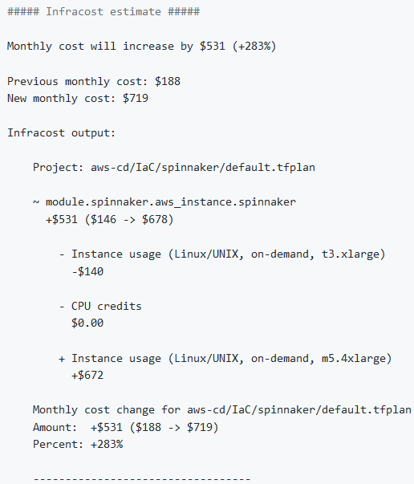
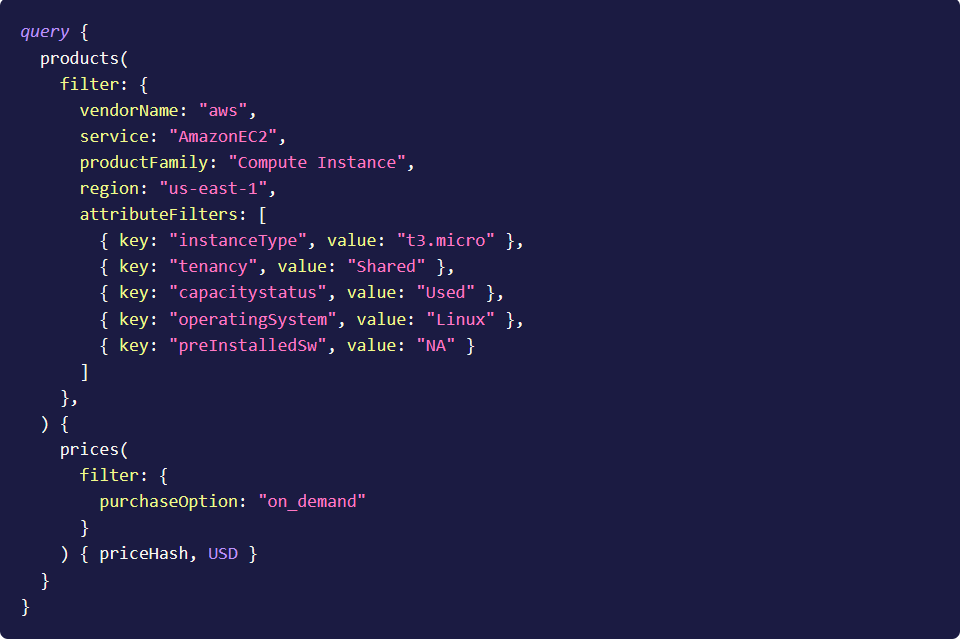

<h1 align="center">  Supported Linters and Static Code Analysis tools for Terraform </h1> 

<hr>

Currently, we can use the following:
 * [TFLint](https://github.com/terraform-linters/tflint/blob/master/docs/user-guide/config.md), a pluggable Terraform Linter
 * [Checkov](https://www.checkov.io/), a tool for scanning cloud infrastructure configuration misconfigurations.
 * [Regula](https://regula.dev/), a tool for scanning cloud infrastructure configuration misconfigurations.
 * [Cloud Custodian](https://cloudcustodian.io/), a rules engine for managing public cloud accounts and resources, it is needed to write your own policies in [custodian.yml](../custodian.yml) file.
 * [Epam Custodian](https://github.com/epam/ecc/blob/main/c7n/README.md), Custodian-as-a-service is a serverless service-wrapper over another opensource tool - [Cloud Custodian](https://cloudcustodian.io/).
 * [tfsec](https://tfsec.dev/), a static analysis security scanner for Terraform code.
 * [Infracost](https://www.infracost.io/), a cloud cost estimation tool for Terraform in pull requests.

In order to use a specific linter, you have to set the environmental variable of the linter to `1` in the [Atlantis workflow](../atlantis.yaml). If you don't want to use some linters, specify its environmental variable to `0`.
<hr>

## TFLint
TFLint is a framework and each feature is provided by plugins, the key features are as follows:

* Find possible errors (like invalid instance types) for Major Cloud providers (AWS/Azure/GCP).
* Warn about deprecated syntax, unused declarations.
* Enforce best practices, naming conventions.

To integrate `TFLint` with `terragrunt` we use `terragrunt hook` accordingly this [terragrunt recommendation](https://terragrunt.gruntwork.io/docs/features/hooks/):
* To run TFLint automatically, we add TFLint commands to `terragrunt hook`:
    ```hcl
    terraform {
      #  source = "${local.base_source_url}?ref=v0.7.0"
      source = "${local.base_source_url}"
      after_hook "validate_tflint" {
        commands = ["validate"]
        execute  = [
          "sh", "-c", <<EOT
                echo "---------------- TFLint Report --------------"
                tflint -v || exit 0
                tflint --init --config "${get_repo_root()}/.tflint.hcl" || exit 0
                tflint --config "${get_repo_root()}/.tflint.hcl" || exit 0
              EOT
        ]
      }
    }
    ```
* Configuration file [.tflint](../.tflint.hcl) we put to the root of the repository.
* To avoid getting an error, if you don't install TFLint locally, we added `exit 0`

## Infracost 

To use `Infracost`, an API key must be generated. To do that, you need to:
```
$ curl -fsSL https://raw.githubusercontent.com/infracost/infracost/master/scripts/install.sh | sh
$ infracost register
```
We use `INFRACOST_API_KEY` env in `./atlantis.yaml` to connect to Infracost. 

You need to add `infracost_api_key` variable to [parameter_store.hcl](../terragrunt-infrastructure-example/parameter_store_example.hcl)

To calculate the estimated costs of your infrastructure, Infracost sends [data](https://www.infracost.io/docs/faq#what-data-is-sent-to-the-cloud-pricing-api) to the server where data is processed. 

If `Infracost` was run initially, it would show the entire infrastructure's estimated cost. Consecutive runs will show only the *DELTA*.

**Example output:**

 

**Example request:**



If you don't want this to happen, either the tool can be disabled, or you can run your own [Cloud Pricing API](https://www.infracost.io/docs/faq#can-i-run-my-own-cloud-pricing-api).

## TFSec

Useful flags that can help with modifying the command according to your infrastructure needs:
```
$ tfsec --exclude <rule_name> -> to exclude false positives
$ tfsec --soft-fail -> security-related issues will not impact the exit status code of the command
$ tfsec --concise-output -> will only print out security misconfiguration without additional statistics
```
All these tools are integrated into [atlantis](../atlantis.yaml) workflow.

#### [Previous page](../README.md)