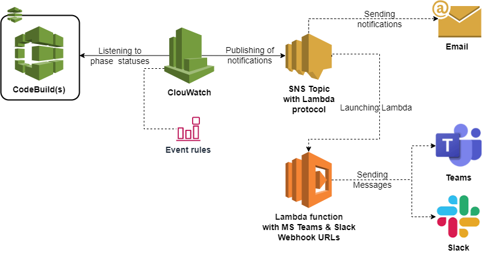

<h1 align="center"> Notifications </h1>

#### Supporting Email, Microsoft Teams and Slack notifications from CodeBuild/CodePipeline.

* The diagram below presents the architecture created after deploying [notifications](../modules/accelerator/notifications) module:

* `CloudWatch Event rules` watches for a specific type of event from `CodeBuild/CodePipeline`. When a matching event comes in, the rule routes it to one or more targets(`SNS topic`) which trigger the notification lambda function. 
* If you define one of the notification methods, you get a notification there.
 

#### [Previous page](./cicd.md)