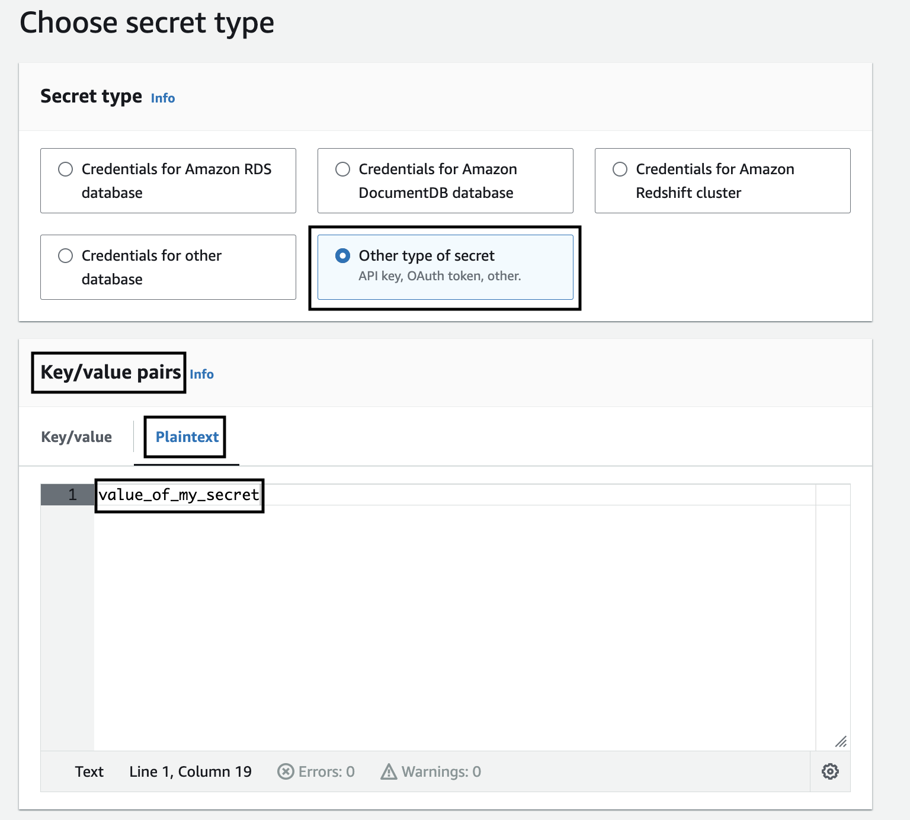
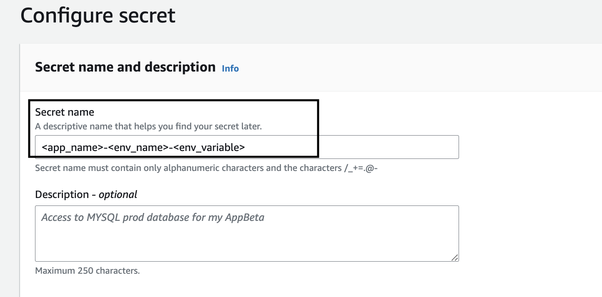

<h1 align="center"> Instructions for Passing environments Secret Variables during deployment to ECS </h1>
Usually applications use environment variables. This is documentation about how to pass secret environment variables during deployment to ECS.

Before you begin, ensure you have a `secret` stored in `AWS Secrets Manager` with the necessary data.

#### 1. Adding a Secret to AWS Secrets Manager
- Go to AWS Secrets Manager.
- Create a new secret and specify its name and value. For example, this could be a login and password for a database.
- Choose secret type `Other type of secret`
- In `Key/value pairs` use plaintext to specify secrets, remove `{"":""}`, add your secrets as it is (not in json format)

- The name of the secret can be anything, but it would be a good idea to follow a naming convention, for examle: <app_name>-<env_name>-<env_variable>

- Copy the ARN (Amazon Resource Name) of the secret. ARN is a unique resource identifier in AWS.

#### 2. Saving Secret Variables in env.hcl File
- Open the `terragrunt-infrastructure-live` directory containing your application.
- In this directory, navigate to the folder corresponding to your environment, e.g., `terragrunt-infrastructure-live/accelerator/accounts/accelerator/regions/eu-central-1/applications/javaapp`.
- In this folder, there should be a file named `env.hcl` that contains information about secret variables for this environment.
- Add the secret variables to the `env.hcl` file. Here's an example of how to do it:
```
secrets = {
    dev = [
      {
        name = "DB_PASSWORD",
        valueFrom = "arn:aws:secretsmanager:eu-west-1:123408383462:secret:javaapp-xtLmJ2"
      }
    ]

    qa = []

    uat = []
  }
```
`DB_PASSWORD` - name of environment variable, in `valueFrom` specify ARN of the secret you created in `AWS Secrets Manager`.

#### 4. Deployment Workflow
- Save the `env.hcl` file after adding the secret variables.
- Push the changes to the repository.
- Create a pull request and Atlantis will run the `terragrunt plan` command.
- If everything fine after `terragrunt plan`, add pull request comment - `atlantis apply` to apply changes.

This guide will help you pass secret environment variables during deployment for different environments in your infrastructure. 
Please make sure to replace `NAME` and `valueFrom` with the actual values used by your application.

